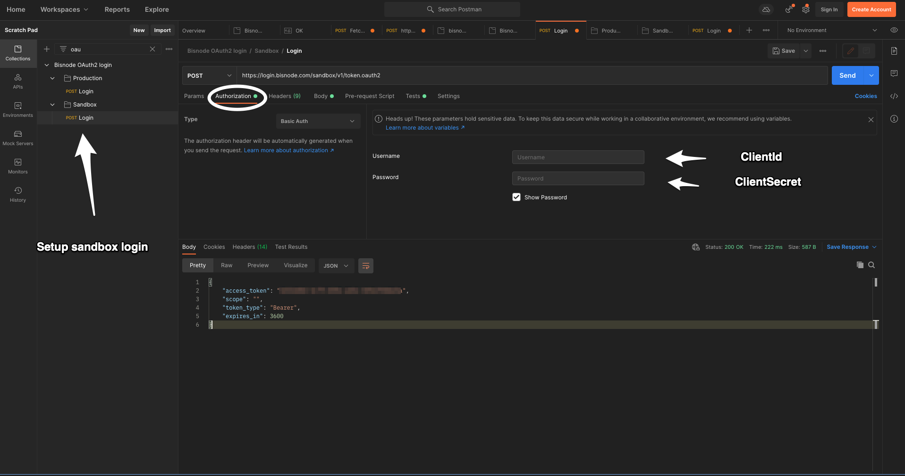
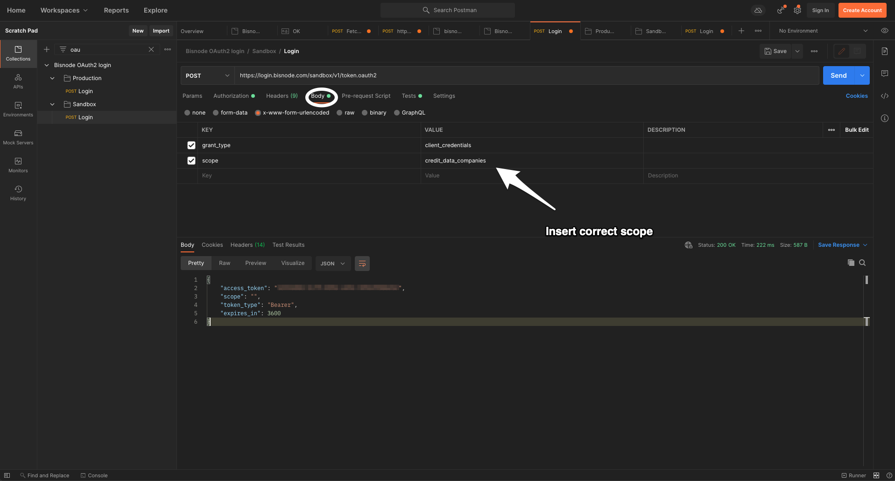

# OAuth2 login setup

To authenticate with the OAuth2 endpoints in Bisnode's API platform we have provided you with a postman collection to get started.

Import the [collection](https://raw.githubusercontent.com/Bisnode/api-stuff/master/apis/login/Bisnode_OAuth2_login.postman_collection.json) into postman and update the configuration in postman according to the pictures below.

